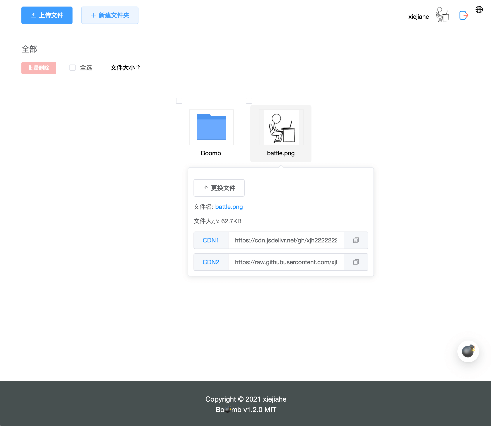

<p align="center">
  <a href="https://boomb.cn">
    
  </a>
  <p align="center">基于 Github 轻松管理您的存储图库</p>
  <p align="center">有的小伙伴会把它当做图床使用，这完全是您个人选择问题，与作者无任何关系。</p>
  <p align="center">
    <a href="README.md">
      
    </a>
    
    
    
  </p>
</p>


## 截图



## 像数 1, 2, 3 一样容易
1. [创建一个仓库](https://github.com/new)
2. 申请Token => [https://github.com/settings/tokens](https://github.com/settings/tokens)
3. 打开 [https://boomb.cn](https://boomb.cn).


## 内置
- [Vue3](https://github.com/vuejs/vue-next)
- [Element Plus](https://github.com/element-plus/element-plus)
- [TypeScript](https://github.com/Microsoft/TypeScript)


## 构建
```bash
# 安装依赖
$ yarn

# 启动 localhost:7000
$ yarn start

# 打包
$ yarn build
```


如果您是部署到自己服务器上，你可能需要 [Github OAuth2](https://github.com/xjh22222228/github-oauth2)

但作者不建议您自己部署, 开箱即用，即用即走。


## License
[MIT](LICENSE)

